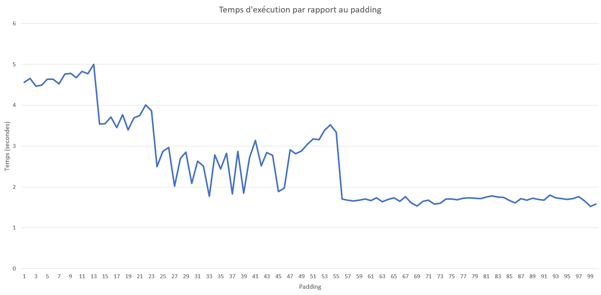

# Techniques Modernes de Programmation Concurrente - Rapport TD1

_Thomas CANAVA - Johann MORTARA_

## Exercice 1

### Compilation
Pour compiler les fichiers dans le dossier `exo1` il faut faire :
- `make` pour compiler le fichier sans optimisations
- `make NB=n opti` pour compiler le fichier avec l'optimisation niveau `n`
- `make PADDING=n padding` pour compiler le fichier avec un padding `n`

### Question 1.1

Pour rendre la fonction concurrente il faut rajouter le mot clé `__thread` devant les variables `x,y,z`.

### Question 1.2

Le _bottleneck_ est le tableau  `results` car on y accède en écriture dans chaque thread, ce qui fait que le tableau est répliqué dans les caches des différents cœurs de chaque thread.
On peut régler simplement ce problème en faisant en sorte que les threads renvoient chacun leur résultat au moment de l'attente.

En lançant avec les optimisations on remarque que le temps d'exécution réel est grandement réduit : on passe de *4 s* sans optimisation à *400 ms* avec l'optimisation maximale.

### Question 1.3

Comme nous pouvons le voir sur le graphique, le temps d'exécution réel diminue en augmentant le padding.
Ceci s'explique par le fait que les variables étants éloignées en mémoire, celles-ci ne sont plus synchronisées en étant partagées sur tous les caches. 

## Exercice 2

### Question 2.1

Le temps d'exécution réel est de *3.166 s*.
Le *False Sharing* viens de la liste de `ThreadInfo`. Comme ils sont proches en mémoire, le cache se retrouve répliqué à chaque écriture alors que chaque variable `result` n'est utilisée que par un `Thread`.

### Question 2.2 

Si on rajoute un `volatile` le temps d'exécution réel augmente car il synchronise les threads.

### Question 2.3

Si on rajoute un padding, le temps d'exécution réel est alors de *976 ms*.